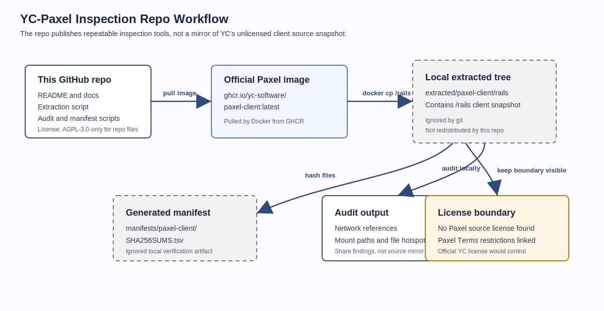
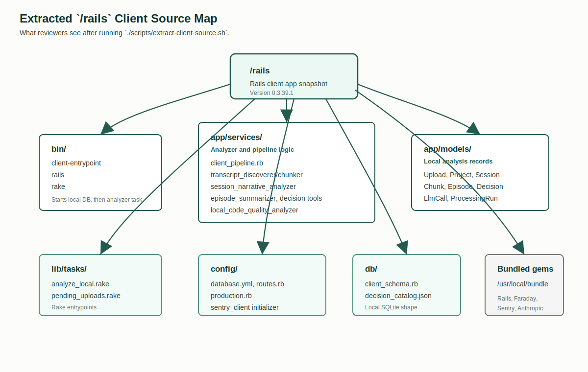
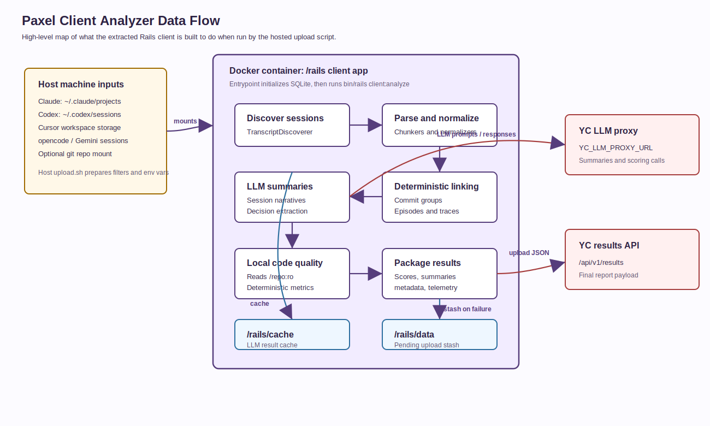

# Architecture

This repository is an inspection kit for the Paxel client Docker image. It does
not host the extracted Paxel source tree; it documents how to extract and audit
that tree locally.

## Visual Overview

### Repository Workflow

The repository stores scripts and documentation. The official Paxel image is
pulled from GHCR, `/rails` is copied into `extracted/`, and reviewers can
generate ignored local manifests and audit summaries.

### Extracted Client Source Map

After extraction, the relevant client snapshot lives under
`extracted/paxel-client/rails`. The main implementation is a Rails app with:

- `bin/client-entrypoint`, which initializes the local SQLite schema and runs the
  analyzer task.
- `lib/tasks/analyze_local.rake`, which prepares the analysis run inside the
  container.
- `app/services/client_pipeline.rb`, which coordinates discovery, parsing,
  summarization, local code-quality analysis, packaging, and upload.
- `app/models`, which define local analysis records such as uploads, projects,
  sessions, chunks, episodes, decisions, and LLM calls.
- `db/client_schema.rb`, which defines the local SQLite schema.

### Client Analyzer Data Flow

The hosted `upload.sh` script prepares host-side inputs and runs the client
image. The container receives transcript mounts, optional read-only repo mounts,
cache/data/log mounts, and environment variables for YC auth, the LLM proxy, and
the results endpoint.

Inside the Rails client, the pipeline discovers sessions, normalizes transcripts,
calls the YC LLM proxy for summaries and scoring, runs deterministic linking and
local code-quality analysis, then posts an assembled JSON payload to the YC
results API. Cache data and pending upload stashes remain local to the configured
Docker volume or host bind mount.

## Repository Surfaces

- `README.md`: orientation, quick start, license boundary, and official links.
- `docs/extract-client-source.md`: extraction guide and inspection commands.
- `docs/community-audit.md`: recommended review workflow for community auditors.
- `docs/license-boundary.md`: redistribution and licensing boundary.
- `docs/diagrams/*.svg`: static visual diagrams for the extracted client layout
  and data flow.
- `scripts/extract-client-source.sh`: pulls the official image and copies `/rails`
  into `extracted/`.
- `scripts/generate-source-manifest.sh`: generates local hashes for the extracted
  files.
- `scripts/audit-client-source.sh`: prints a review-oriented summary of outbound
  calls, mount paths, filesystem hotspots, and redaction references.

## What Is Intentionally Not Tracked

- `extracted/`: local copy of third-party Paxel/Y Combinator files.
- `manifests/`: local generated hashes and manifest summaries.
- `tmp/`: local audit output and scratch files.

Those directories are ignored because this repository is an inspection workflow,
not a redistribution mirror.

